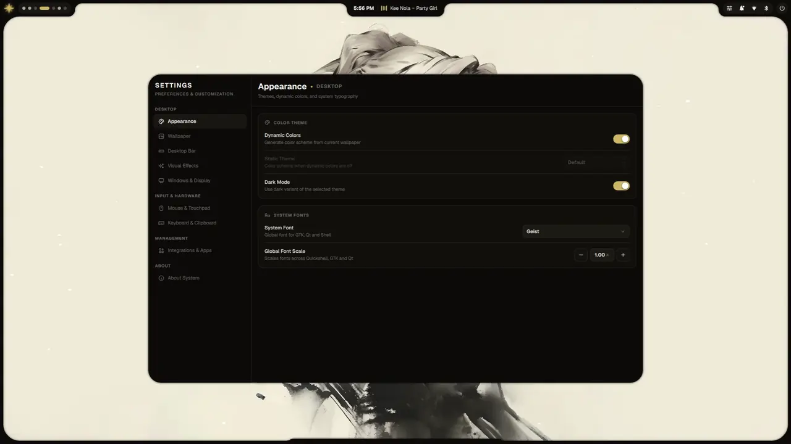
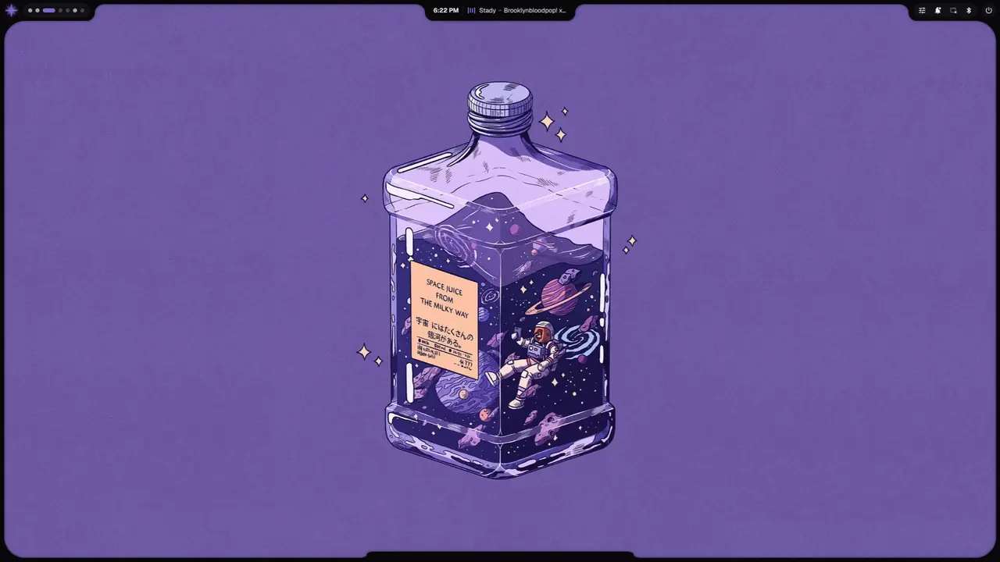
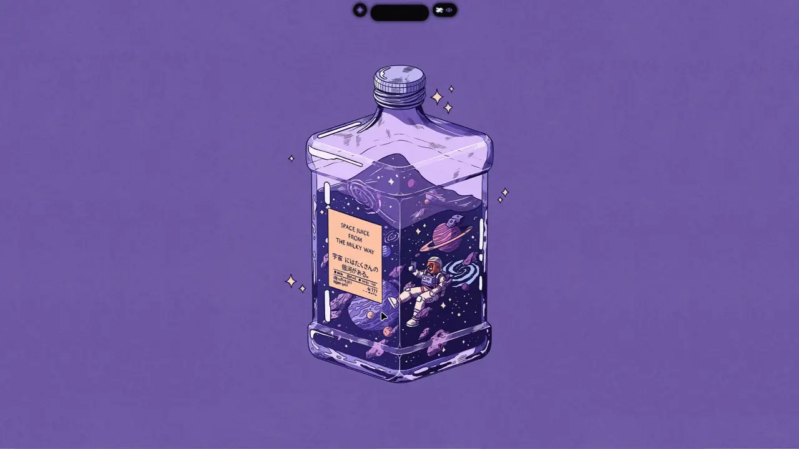
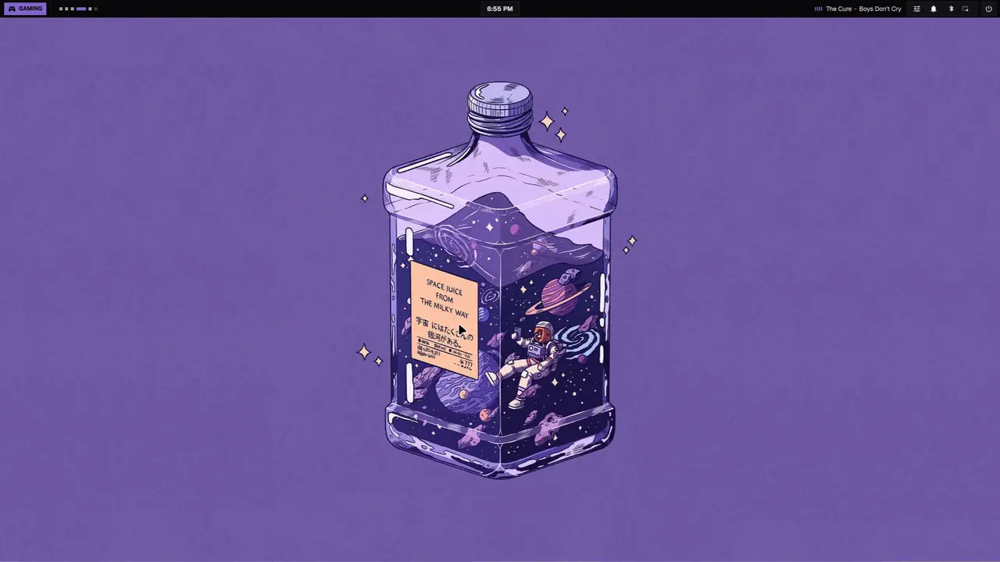
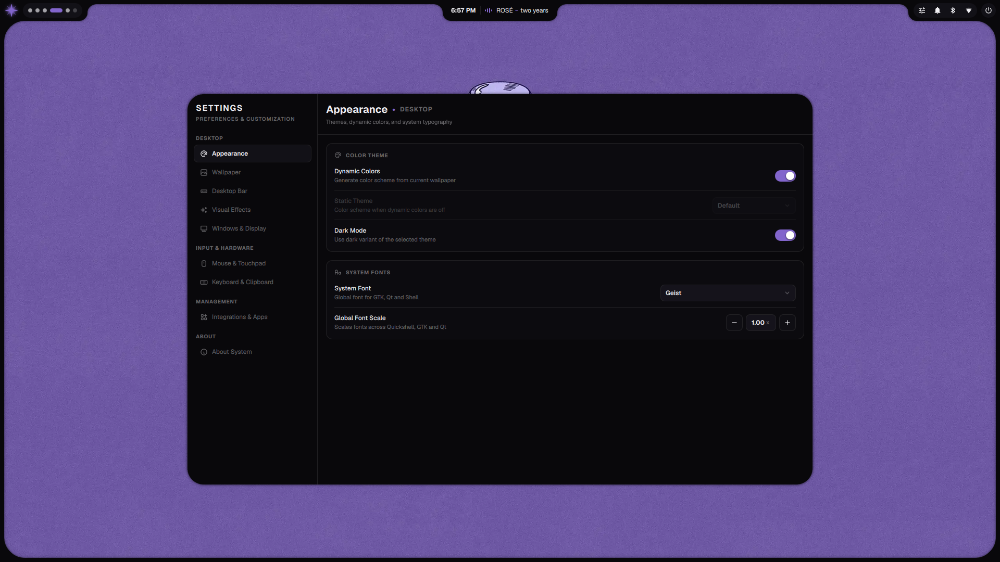
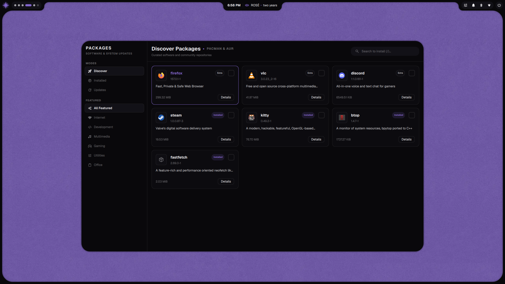
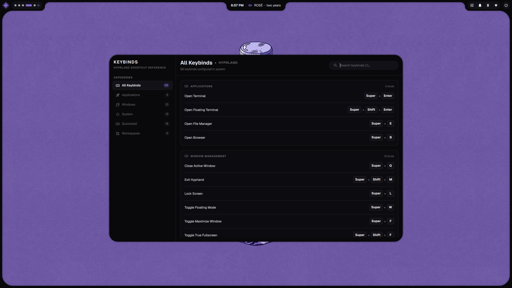
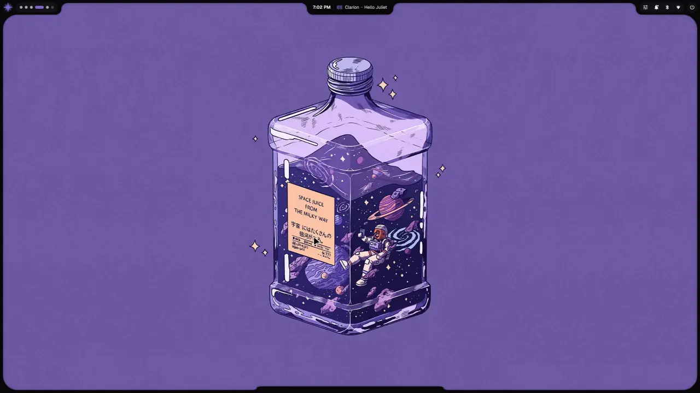

<div align="center">

# Minflair

**A modular, aesthetic Hyprland desktop environment for Arch Linux, powered by Quickshell and dynamic system-wide theming.**

<br />

<a href="#gallery">
  
</a>

<br /><br />



</div>

---

## ✨ Features

- 🎨 **Unique Shell Styles** — Switch effortlessly between **Convex** (organic curved frames where widgets flow naturally into the screen contours) and **Island** (a floating pill bar with dynamic expandable widgets).
- 🎮 **One-Click Gaming Mode** — Maximize game performance instantly: strips away animations, blur, and borders while activating variable refresh rate (VRR) and ultra-low latency.
- 🌈 **Adaptive Wallpaper Theming** — Pick any wallpaper and watch your entire system adapt harmoniously—synchronizing your bar, terminals, Neovim, GTK, Qt, and apps in real time.
- 🖼️ **Wallpaper Framing & Cropping** — Crop, align, and preview wallpapers directly from settings with live aspect-ratio framing, scaling options, and smooth auto-shuffle transitions.
- 🎛️ **Intuitive Settings Center** — Customize mouse sensitivity, touchpad gestures, system fonts, and bar appearance through an elegant graphical interface without editing config files.
- 🎵 **Music Player & Visualizer** — A standalone media widget with live audio visualizer bars, album art, interactive seek bar, and playback controls.
- 🔔 **Notification Center** — Stay organized with a dedicated notification panel, status bar unread badge, and one-click clear-all.
- 📦 **Modern Package Manager** — Discover, inspect, install, and update official Arch Linux and AUR packages through a clean, searchable graphical store.
- 🖼️ **Wallpaper Selector** — Browse and switch your wallpaper collection on the fly from an interactive grid.
- 🔒 **Aesthetic Lock Screen** — A sleek lock screen that matches your active wallpaper and theme with quick system metrics.
- ⚡ **Developer-Ready Terminal** — Out-of-the-box developer environment featuring Zsh, Starship prompt, fast directory jumping, LazyGit, and a theme-synced Neovim setup.
- 🔋 **Battery Health Protection** — Built-in toggle to limit laptop battery charging to 80% to prolong battery lifespan.

---

## 🚀 Quick Install

```bash
# Clone this repository (shallow clone to save space and time)
git clone --depth 1 https://github.com/t4lentles5/minflair.git ~/.dotfiles

# Enter the directory
cd ~/.dotfiles

# Give execution permissions to the script and run it
chmod +x install.sh
./install.sh
```

> [!IMPORTANT]
>
> - This script is designed exclusively for **Arch Linux** distributions.
> - Run the script as your **normal user**. It will ask for `sudo` only when needed to install system packages.

---

## 🔧 Post-Installation Setup

### 1. Reboot

Once installation completes, **reboot your computer** so all services, themes, and shell environments take effect:

```bash
sudo reboot
```

### 2. Set your profile picture (`.face`)

To display your personal avatar on the dashboard and lock screen, place a square image (`PNG` or `JPG`) at `~/.face`:

```bash
cp /path/to/your/avatar.png ~/.face
```

### 3. Add your wallpapers

Wallpapers are stored in `~/Pictures/Wallpapers/`. Add your favorite images there and use the wallpaper selector (`Ctrl + Alt + W`) to switch between them instantly.

### 4. Monitor Configuration

Displays are configured to auto-detect by default. If you need a custom resolution, refresh rate, or multi-monitor arrangement, configure:

```bash
~/.config/hypr/monitors.lua
```

### 5. Restore from Backup

If needed, the installer preserves a timestamped backup of your previous configuration at:

```
~/.dotfiles_backup/<timestamp>/
```

### 6. OCR Text Extraction Languages

The screen capture OCR feature comes with English and Spanish language packs preinstalled. To add other languages (such as French, German, or Japanese), install the corresponding package:

```bash
# Example for French
sudo pacman -S tesseract-data-fra
```

### 7. Battery Charge Limit (Laptops)

The Control Center includes an 80% charge limit toggle to prolong battery lifespan. The installer automatically detects your hardware and configures support for major laptop brands (ASUS, Lenovo, Dell, Acer, Apple Silicon, Framework, HP, and others).

---

<a id="gallery"></a>

## 🖥️ Shell Styles & Desktop Experience

Minflair is designed around distinct bar architectures and a unified suite of desktop utilities. You can switch styles anytime directly from the Settings app:

### 🌟 Convex Style
The signature desktop layout. Features an organic curved bezel frame where top widgets (Control Center, Notifications, Music, Dashboard) and bottom tools (Launcher, Clipboard, Wallpaper Selector) connect directly into the screen contours.



### 🏝️ Island Style
A modern, floating pill bar with an expandable dynamic island center. Notifications, media playback, and quick controls expand smoothly from the island while preserving maximum screen real estate.



### 🎮 Gaming Mode
An ultra-clean, zero-overhead bar dedicated to gaming sessions. Strips away all blur, animations, and rounded frames, activating tear-free variable refresh rate (VRR) and minimal latency for maximum performance.



### 📱 Standalone Applications
Deep graphical customization built natively for Arch Linux:

| **Settings App** | **Package Manager** | **Keybinds Cheat Sheet** |
| :---: | :---: | :---: |
|  |  |  |
| Complete control over wallpapers, cropping, touchpad, and desktop effects. | Searchable GUI store to inspect, install, and update Arch & AUR packages. | Interactive shortcut browser accessible anytime with `Super + K`. |

### 🔒 Lock Screen
A clean, wallpaper-matched lock screen featuring PAM authentication, smooth unlock transitions, and real-time battery and system status.



### 🎛️ Shell Utilities & Overlays
All desktop styles share a cohesive, shared set of utilities:

- **Notification Center**: Dedicated panel for alert history with an unread badge on the bar.
- **Music & Visualizer**: Sleek media player with album artwork, live audio bars, and seek control.
- **Launcher & Clipboard**: Fast keyboard-driven app search and clipboard history manager.
- **Screen Capture**: All-in-one screenshot tool (region/window/delay/OCR) and screen recorder.
- **Power Menu**: Minimal session controls for sleep, reboot, and shutdown.

## ⌨️ Keybinds

> [!NOTE]  
> You don't need to memorize these! Press `SUPER + K` at any time to open the built-in **Keybinds Cheat Sheet** directly on your desktop!

## ❓ Troubleshooting

<details>
<summary><b>Inspect Quickshell logs or debug UI issues</b></summary>

If any widget is not showing up or an error occurs in the UI, you can view live Quickshell logs in your terminal:

```bash
qs log
```

This will output real-time QML errors, warnings, missing components, or script failures.

</details>

<details>
<summary><b>Battery charge limit toggle not working</b></summary>

Ensure your laptop vendor supports charging thresholds via the Linux kernel. Check if your vendor's kernel module is loaded (e.g. `asus_wmi`, `ideapad_laptop`, `thinkpad_acpi`). For Acer laptops, the installer automatically configures `acer-wmi-battery-dkms`.

</details>

<details>
<summary><b>Quickshell dashboard shows a generic avatar</b></summary>

Place a square image at `~/.face` (PNG or JPG). The dashboard reads it from `$HOME/.face`. SDDM also uses this file for the login screen.

```bash
cp /path/to/avatar.png ~/.face
```

</details>

<details>
<summary><b>No wallpapers appear in the wallpaper selector</b></summary>

You must manually place your own wallpapers in the `~/Pictures/Wallpapers/` directory. Create this directory if it doesn't exist and add your images there.

</details>

<details>
<summary><b>GTK apps don't follow the theme change</b></summary>

Nautilus is automatically restarted when switching between light ↔ dark mode. For other GTK apps, you may need to close and reopen them. The `nwg-look` tool is used during installation to apply the initial GTK settings.

</details>

<details>
<summary><b>Notifications aren't showing</b></summary>

The installer disables `dunst` because Quickshell handles notifications natively. If you installed another notification daemon, it may conflict. Check with:

```bash
systemctl --user status dunst.service
```

</details>

<details>
<summary><b>Installation errors or packages failed to install</b></summary>

The installer automatically captures all warnings and errors in a log file. You can check it to find out exactly what went wrong:

```bash
cat ~/install_errors.log
```

If packages failed to install, ensure your mirrors are up to date (`sudo pacman -Syy`) and that your AUR helper is working correctly (`yay -Syu`).

</details>

## 📜 License and Credits

This project is licensed under the [GNU General Public License v3.0](LICENSE).

### Third-Party Assets & Projects

- **Tabler Icons**: Licensed under the [MIT License](https://github.com/tabler/tabler-icons/blob/master/LICENSE).
- **Material Symbols (Google Fonts)**: Licensed under the [Apache License 2.0](https://www.apache.org/licenses/LICENSE-2.0).
- **Material GNOME Theme**: Custom fork at [t4lentles5/material-gnome-theme](https://github.com/t4lentles5/material-gnome-theme) (upstream: [SakibShahariar/material-gnome-theme](https://github.com/SakibShahariar/material-gnome-theme)), licensed under the [GNU General Public License v3.0](https://github.com/SakibShahariar/material-gnome-theme/blob/main/LICENSE).
- **luna.nvim**: Custom fork at [t4lentles5/luna.nvim](https://github.com/t4lentles5/luna.nvim) (upstream: [WTFox/luna.nvim](https://github.com/WTFox/luna.nvim)), licensed under the [MIT License](https://github.com/WTFox/luna.nvim/blob/main/LICENSE). Tailored specifically for Minflair to enable real-time dynamic palette hot-reloading and automatic Lualine synchronization.
- **Simple Icons**: Licensed under the [CC0 1.0 Universal License](https://creativecommons.org/publicdomain/zero/1.0/).
